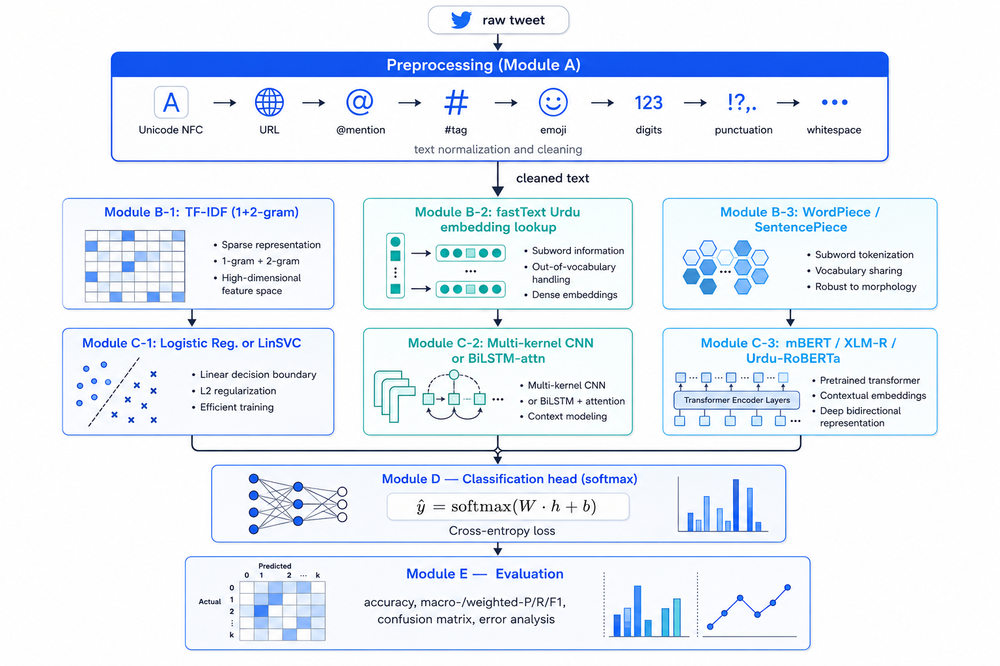

# Assignment 3 — Task 2

## Proposed Architecture and Mathematical Modelling

**Course:** CSC-355 Natural Language Processing
**Students:** Raqib Hayat (NUM-BSCS-2022-40), Abu Bakar (NUM-BSCS-2022-41)
**Project:** Robust Sentiment & Emotion Classification on Noisy Urdu Tweets (SentiUrdu-1M)

This document fulfils Task 2 of the milestone. Section 1 presents the end-to-end system as a chain of logical modules. Sections 2–7 explain each component and present its mathematical formulation, with cross-references to the implementation in `02_model_implementation.ipynb`.

### Label conventions

Throughout the rest of this document the **emotion task** is a 6-way classification over the canonical label set
$\mathcal{Y}_{\text{emo}} = \{\text{Joy}, \text{Sad}, \text{Angry}, \text{Fear}, \text{Disgust}, \text{Surprise}\}$, obtained from a majority-vote normalisation of the noisy multi-shape `Category` column in SentiUrdu-1M (which also includes the misspelling "Surprice"). The **sentiment task** is a 3-way classification over $\mathcal{Y}_{\text{sent}} = \{\text{Negative}, \text{Neutral}, \text{Positive}\}$, derived from the emotion label by the map $\text{Joy}\to\text{Positive}$, $\{\text{Sad}, \text{Angry}, \text{Fear}, \text{Disgust}\}\to\text{Negative}$, $\text{Surprise}\to\text{Neutral}$. Both tasks use the same $\approx$ 533 K Category-labelled rows; the $\approx$ 515 K rows without a `Category` are excluded because their only available label signal (emoji co-occurrence) is too weak.

---

## 1 — System Architecture Overview

The system is a *single pipeline with three swappable model heads* — classical, deep, and transformer. Every model sees an identical preprocessed input and is evaluated by an identical metrics module, ensuring the comparison is fair.

The same dataset split (`seed=42`, stratified 70 / 15 / 15) is reused by every model. All inputs flow through the *same* `preprocess_tweet` function in `preprocessing.py`, which is the executable form of the mathematical pipeline in §2.

---

## 2 — Module A — Text Preprocessing

The preprocessing pipeline is a finite composition of eight pure string transformations. Each $t_i : \Sigma^* \!\to\! \Sigma^*$ maps a tweet string to another tweet string, and the full pipeline is

$$
T(x) \;=\; (t_8 \circ t_7 \circ t_6 \circ t_5 \circ t_4 \circ t_3 \circ t_2 \circ t_1)(x).
$$

| Step | $t_i$ | Operation | Purpose |
|---|---|---|---|
| 1 | $t_1$ | $\text{NFC}(x)$ | unify equivalent Unicode codepoints |
| 2 | $t_2$ | $x \mapsto x \setminus \text{URL}(x)$ | drop `http(s)://…` and `www.…` |
| 3 | $t_3$ | $x \mapsto x \setminus \{@u\}$ | drop @mentions |
| 4 | $t_4$ | $x \mapsto x[1{:}\,]$ on each $\#w$ | keep the word, drop the `#` |
| 5 | $t_5$ | $x \mapsto x \setminus \mathcal{E}$ | **remove emojis** — prevents label leakage |
| 6 | $t_6$ | $x \mapsto x \setminus \Sigma_{\text{digit}}$ | strip Western and Eastern Arabic-Indic digits |
| 7 | $t_7$ | $x \mapsto x \setminus \Sigma_{\text{punct}}$ | strip ASCII + Urdu/Arabic punctuation |
| 8 | $t_8$ | collapse runs of `\s+` to ` ` | whitespace normalisation |

The mathematical *necessity* of step 5 — emoji removal — is the crux of the project. The SentiUrdu-1M label $y$ is a deterministic function of the emoji set $\mathcal{E}(x)$ via the SentiWordNet heuristic $\sigma$:

$$
y(x) \;=\; \sigma\big(\mathcal{E}(x)\big).
$$

A model that observes $\mathcal{E}(x)$ as part of its input can therefore approximate $\sigma$ exactly without learning any Urdu lexical or syntactic structure, producing artificially high accuracy. Step 5 enforces $\mathcal{E}(T(x)) = \emptyset$, restoring information-theoretic separation between $T(x)$ and $y$.

---

## 3 — Module B — Feature Extraction / Embedding Layer

### 3.1 Family 1 — TF-IDF (sparse, classical)

Given the cleaned training corpus $D=\{d_1,\dots,d_N\}$ and vocabulary $V$:

- **Term frequency**

  $$
  \text{tf}(t,d) \;=\; \frac{f_{t,d}}{\sum_{t'\in d} f_{t',d}}.
  $$

  We use the **sub-linear** variant $\text{tf}(t,d)\leftarrow 1+\log f_{t,d}$ to dampen the effect of high-frequency words on long documents.

- **Inverse document frequency**

  $$
  \text{idf}(t,D) \;=\; \log\!\frac{|D|+1}{|\{d\in D : t\in d\}|+1} + 1
  $$

  (the `+1` smoothing term is the scikit-learn default and prevents division by zero).

- **TF-IDF vector**

  $$
  \mathbf{x}_d \in \mathbb{R}^{|V|}, \qquad
  \mathbf{x}_d[t] \;=\; \text{tf}(t,d)\,\cdot\,\text{idf}(t,D).
  $$

- **N-gram extension.** We vectorise on the union $V_{1{\cup}2}=V_1 \cup V_2$ of unigrams *and* bigrams (`ngram_range=(1,2)`), capped at the `max_features = 50 000` most-frequent terms with `min_df = 3`.

Documents are L2-normalised so that the linear classifier scoring function $w^\top x$ behaves as a cosine score.

### 3.2 Family 2 — Static word embeddings (for CNN / BiLSTM)

Each token $t$ in the cleaned text is mapped to a dense vector $w_t \in \mathbb{R}^d$ with $d=300$. A sequence of $n$ tokens becomes the matrix

$$
X \;=\; [\,w_1,\,w_2,\,\dots,\,w_n\,] \;\in\; \mathbb{R}^{n\times d}.
$$

We initialise the embedding matrix $E \in \mathbb{R}^{|V|\times d}$ from **fastText's** publicly released **`cc.ur.300`** vectors trained on Common Crawl + Wikipedia Urdu. Unseen tokens map to a single `<unk>` row drawn from $\mathcal{N}(0, 0.1^2)$ and the `<pad>` row is the zero vector. The matrix is left trainable so the network can specialise the vectors for the target tasks.

Using pretrained Urdu vectors (rather than random init) is what justifies a fair head-to-head with the transformer family: both families now begin with strong pre-existing knowledge of Urdu morphology and distributional semantics.

### 3.3 Family 3 — Contextual subword embeddings (mBERT / XLM-R / Urdu-RoBERTa)

A subword tokeniser $\tau$ (WordPiece for mBERT, SentencePiece-BPE for XLM-R, BPE for Urdu-RoBERTa) maps the cleaned text $T(x)$ to a sequence of subword IDs $[s_1,\dots,s_n]$. The encoder produces

$$
\mathbf{h}_i \;=\; \text{Transformer}_\theta(s_1,\dots,s_n)_i \in \mathbb{R}^{d_{\text{model}}}.
$$

The full input embedding for position $i$ in BERT-style models is the sum of three learned components (token, segment, position) followed by layer-norm:

$$
\mathbf{e}_i \;=\; \text{LN}\big(E_{\text{tok}}[s_i] + E_{\text{seg}}[\,0\,] + E_{\text{pos}}[i]\big).
$$

The pooled representation used for classification is the final-layer hidden state of the `[CLS]` (BERT) or `<s>` (RoBERTa) token: $\mathbf{h}_{\text{[CLS]}}\in\mathbb{R}^{d_{\text{model}}}$, with $d_{\text{model}}=768$ for the base-sized models we fine-tune.

---

## 4 — Module C — Model Architectures

### 4.1 Logistic Regression (multinomial)

For $K$ classes and feature vector $\mathbf{x}\in\mathbb{R}^{|V|}$, the model maintains a weight matrix $W \in \mathbb{R}^{K\times|V|}$ and bias $\mathbf{b}\in\mathbb{R}^K$. The posterior is given by the softmax

$$
P(y=k\,|\,\mathbf{x}) \;=\; \frac{\exp(\mathbf{w}_k^\top \mathbf{x} + b_k)}{\sum_{j=1}^{K}\exp(\mathbf{w}_j^\top \mathbf{x} + b_j)}.
$$

Parameters are estimated by minimising the (weighted) cross-entropy with L2 regularisation:

$$
\mathcal{L}_{\text{LR}}(W,\mathbf{b}) \;=\; -\frac{1}{N}\sum_{i=1}^{N} \alpha_{y_i}\;\log P(y_i\,|\,\mathbf{x}_i) \;+\; \frac{1}{2C}\|W\|_F^2,
$$

where $\alpha_k$ is the inverse-frequency class weight (`class_weight="balanced"` in scikit-learn) and $C$ is the inverse-regularisation strength. We solve this with the **`saga`** stochastic dual coordinate-ascent solver, which scales gracefully to the 50 000-dimensional sparse feature space.

### 4.2 Linear Support Vector Machine (one-vs-rest)

For each class $k$ we train a hyperplane $(\mathbf{w}_k, b_k)$ that maximises its margin from the data,

$$
\min_{\mathbf{w}_k, b_k, \boldsymbol{\xi}}
   \;\;\frac{1}{2}\|\mathbf{w}_k\|^2 + C\sum_{i=1}^{N}\alpha_{y_i}\,\xi_i,
\quad
\text{s.t. } y_{i,k}(\mathbf{w}_k^\top \mathbf{x}_i + b_k) \geq 1 - \xi_i,\;\;\xi_i \geq 0,
$$

with $y_{i,k}\in\{+1,-1\}$ encoding "class $k$ vs. rest". The kernel trick generalises this to nonlinear features:

$$
K(\mathbf{x}_i,\mathbf{x}_j) \;=\; \phi(\mathbf{x}_i)^\top \phi(\mathbf{x}_j),
$$

but for our 50 000-dimensional sparse features a **linear** kernel ($\phi = \text{id}$) is both faster and at least as accurate, so we use `LinearSVC`. Calibrated probabilities are obtained by Platt scaling for fair confusion-matrix analysis.

### 4.3 Convolutional Neural Network (Kim-style)

For a sentence of length $n$ encoded as $X = [w_1,\dots,w_n] \in \mathbb{R}^{n\times d}$, a 1-D convolution with filter $\mathbf{W} \in \mathbb{R}^{h\times d}$ produces the feature map

$$
c_i \;=\; \text{ReLU}\!\big(\mathbf{W} \cdot X_{i:i+h-1} + b\big), \quad i=1,\dots,n-h+1.
$$

Max-over-time pooling collapses each feature map to a scalar:

$$
\hat{c} \;=\; \max_{1\leq i\leq n-h+1} c_i.
$$

We use $F=128$ filters at each of $h\in\{3,4,5\}$ to capture local 3/4/5-gram patterns, giving a $3F=384$-dimensional sentence representation. A dropout-regularised dense layer then projects to the $K$ logits.

### 4.4 Bidirectional LSTM with attention

The LSTM cell at time $t$ is parameterised by the gates

$$
\begin{aligned}
\mathbf{f}_t &= \sigma\!\big(W_f[\mathbf{h}_{t-1};\mathbf{x}_t] + \mathbf{b}_f\big),
&
\mathbf{i}_t &= \sigma\!\big(W_i[\mathbf{h}_{t-1};\mathbf{x}_t] + \mathbf{b}_i\big), \\
\tilde{\mathbf{C}}_t &= \tanh\!\big(W_C[\mathbf{h}_{t-1};\mathbf{x}_t] + \mathbf{b}_C\big),
&
\mathbf{o}_t &= \sigma\!\big(W_o[\mathbf{h}_{t-1};\mathbf{x}_t] + \mathbf{b}_o\big), \\
\mathbf{C}_t &= \mathbf{f}_t \odot \mathbf{C}_{t-1} + \mathbf{i}_t \odot \tilde{\mathbf{C}}_t,
&
\mathbf{h}_t &= \mathbf{o}_t \odot \tanh(\mathbf{C}_t).
\end{aligned}
$$

We stack two BiLSTM layers, concatenating the forward and backward hidden states $\mathbf{h}_t = [\overrightarrow{\mathbf{h}_t}\,;\,\overleftarrow{\mathbf{h}_t}]$ to obtain a $2H$-dimensional contextual representation. An additive attention layer then summarises the sequence:

$$
\alpha_t \;=\; \frac{\exp(\mathbf{u}^\top \tanh(W_a \mathbf{h}_t + \mathbf{b}_a))}{\sum_{t'}\exp(\mathbf{u}^\top \tanh(W_a \mathbf{h}_{t'} + \mathbf{b}_a))},
\qquad
\mathbf{z} \;=\; \sum_{t=1}^{n}\alpha_t \mathbf{h}_t.
$$

Attention is preferred over simple mean-pooling because it lets the network learn *which* tokens carry the sentiment signal — which is interpretable in error analysis.

### 4.5 Transformer encoder (mBERT, XLM-RoBERTa, Urdu-RoBERTa)

A single Transformer block applies *scaled dot-product self-attention* followed by a position-wise feed-forward network, with residual connections and layer-norm around each:

$$
\text{Attention}(Q,K,V) \;=\; \text{softmax}\!\left(\frac{QK^\top}{\sqrt{d_k}}\right)V.
$$

Multi-head attention runs $h$ such heads in parallel and concatenates them:

$$
\text{MultiHead}(Q,K,V) \;=\; \text{Concat}(\text{head}_1,\dots,\text{head}_h)\,W^O,
\qquad
\text{head}_i = \text{Attention}(QW_i^Q, KW_i^K, VW_i^V).
$$

The position-wise feed-forward is two linear layers with a ReLU (or GELU) non-linearity:

$$
\text{FFN}(\mathbf{x}) \;=\; \text{GELU}(\mathbf{x} W_1 + \mathbf{b}_1)\,W_2 + \mathbf{b}_2.
$$

A residual + layer-norm sub-layer wraps each:

$$
\mathbf{x}' \;=\; \text{LayerNorm}\!\big(\mathbf{x} + \text{SubLayer}(\mathbf{x})\big).
$$

The three pretrained encoders we fine-tune share this structure but differ in scale, tokeniser, and pretraining corpus:

| Model | Tokeniser | Layers | $d_{\text{model}}$ | Heads | Params |
|---|---|---|---|---|---|
| `bert-base-multilingual-cased` | WordPiece (cased, 119 K) | 12 | 768 | 12 | 178 M |
| `xlm-roberta-base` | SentencePiece-BPE (250 K) | 12 | 768 | 12 | 278 M |
| `urduhack/roberta-urdu-small` | BPE (Urdu-only) | 6  | 768 | 12 | ≈ 50 M |

---

## 5 — Module D — Classification Head

All models terminate in a single linear softmax layer over $K$ classes:

$$
\hat{\mathbf{y}} \;=\; \text{softmax}\!\big(W_c \,\mathbf{h} + \mathbf{b}_c\big),
$$

with $\mathbf{h}$ being:

- the TF-IDF vector for LR/SVM,
- $\hat{\mathbf{c}}=[\hat{c}^{(3)};\hat{c}^{(4)};\hat{c}^{(5)}]$ for the CNN,
- $\mathbf{z}$ (attention-pooled BiLSTM output) for the BiLSTM, and
- $\mathbf{h}_{\text{[CLS]}}$ (or `<s>`) for the transformers.

A 0.1–0.3 dropout layer precedes $W_c$ in every neural model to control over-fitting.

---

## 6 — Module E — Loss Functions and Optimisation

### 6.1 Cross-entropy with class weights

For mini-batch $\mathcal{B}$ of size $B$ with one-hot targets $\mathbf{y}_i$:

$$
\mathcal{L}_{\text{CE}} \;=\; -\frac{1}{B}\sum_{i=1}^{B} \alpha_{y_i}\sum_{k=1}^{K} y_{i,k}\,\log \hat{y}_{i,k}.
$$

Inverse-frequency class weights $\alpha_k \propto N/(K\cdot n_k)$ shift the gradient towards rare classes.

### 6.2 Adam / AdamW optimiser

The neural models are trained with **Adam** (CNN/BiLSTM) and **AdamW** (transformers, $W$ decay decoupled from gradient):

$$
\begin{aligned}
\mathbf{m}_t &= \beta_1 \mathbf{m}_{t-1} + (1-\beta_1)\,\mathbf{g}_t, \\
\mathbf{v}_t &= \beta_2 \mathbf{v}_{t-1} + (1-\beta_2)\,\mathbf{g}_t^{\,2}, \\
\hat{\mathbf{m}}_t &= \frac{\mathbf{m}_t}{1-\beta_1^t},
\quad
\hat{\mathbf{v}}_t = \frac{\mathbf{v}_t}{1-\beta_2^t}, \\
\boldsymbol{\theta}_{t+1} &= \boldsymbol{\theta}_t \;-\; \alpha\!\left(\frac{\hat{\mathbf{m}}_t}{\sqrt{\hat{\mathbf{v}}_t}+\varepsilon} + \lambda\,\boldsymbol{\theta}_t\right).
\end{aligned}
$$

with $(\beta_1,\beta_2)=(0.9,0.999)$, $\varepsilon=10^{-8}$, $\lambda=0.01$ (transformers only).

### 6.3 Learning-rate schedule

Transformers use the standard **linear warm-up then linear decay** schedule:

$$
\alpha(t) =
\begin{cases}
\alpha_{\max}\,\dfrac{t}{T_w} & t \leq T_w,\\[6pt]
\alpha_{\max}\,\dfrac{T-t}{T-T_w} & t > T_w,
\end{cases}
$$

with $T_w$ = 6 % of total optimisation steps. CNN and BiLSTM use plain Adam with `ReduceLROnPlateau`.

### 6.4 Regularisation

- L2 weight decay on $W_c$ for every neural model.
- Dropout 0.5 (CNN), 0.4 (BiLSTM), 0.1 (transformer attention + ffn).
- Early stopping with patience = 2 on validation macro-F1.

### 6.5 Mixed-precision

Transformer fine-tuning runs in **fp16** (`accelerate`/`Trainer` autocast) to fit `batch_size = 32` at sequence length 96 on the 16 GB GPU; this roughly doubles throughput at no cost in final accuracy.

---

## 7 — Module E (continued) — Evaluation Metrics

For each class $k$ define the confusion-matrix counts $\text{TP}_k, \text{FP}_k, \text{FN}_k, \text{TN}_k$.

- **Accuracy**

  $$\text{Acc} = \frac{\sum_k \text{TP}_k}{N}.$$

- **Per-class precision and recall**

  $$P_k = \frac{\text{TP}_k}{\text{TP}_k + \text{FP}_k},\qquad
    R_k = \frac{\text{TP}_k}{\text{TP}_k + \text{FN}_k}.$$

- **Per-class F1**

  $$F1_k = \frac{2\,P_k R_k}{P_k + R_k}.$$

- **Macro-F1** — unweighted mean across classes; the *most informative* metric for an imbalanced corpus and the one we will use as the headline number:

  $$F1_{\text{macro}} = \frac{1}{K}\sum_{k=1}^{K} F1_k.$$

- **Weighted-F1** — class-weighted mean (proportional to support); useful as a sanity check but biased toward majority classes:

  $$F1_{\text{weighted}} = \sum_{k=1}^{K}\frac{n_k}{N} F1_k.$$

- **Confusion matrix** $C\in\mathbb{N}^{K\times K}$ with $C_{ij} = \#\{\text{predicted } j \mid \text{true } i\}$, plotted both raw and row-normalised.

These metrics are computed by the *same* scikit-learn utilities for every model, so any difference in the leaderboard is attributable to the model and not to bookkeeping. The per-class breakdown is essential because class imbalance can hide poor minority-class performance behind a high weighted-F1.

---

## 8 — Why this architecture, in one paragraph

Classical TF-IDF baselines establish *what is achievable without modelling Urdu morphology at all* — they set the floor. CNN and BiLSTM with pretrained fastText Urdu vectors test whether local n-gram features and sequential context (respectively) add value over a bag-of-features representation. Fine-tuned multilingual and Urdu-specific transformers then test whether *contextual* subword embeddings — pretrained on large unlabelled corpora — close the gap further. Comparing all three families under identical preprocessing, splits, loss, and metrics directly addresses the research gap identified in Milestone 2: no prior Urdu study performs this three-way comparison on million-scale data with a leak-free input pipeline.
